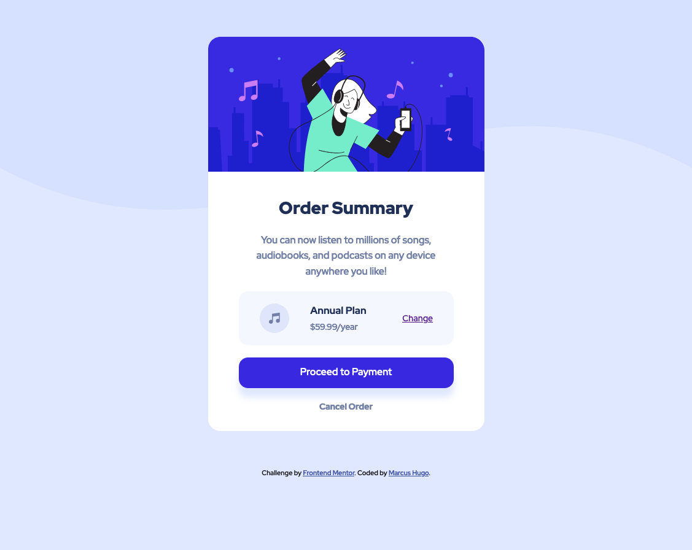

# Frontend Mentor - Order summary card solution

This is a solution to the [Order summary card challenge on Frontend Mentor](https://www.frontendmentor.io/challenges/order-summary-component-QlPmajDUj). Frontend Mentor challenges help you improve your coding skills by building realistic projects.

## Table of contents

- [Overview](#overview)
  - [The challenge](#the-challenge)
  - [Screenshot](#screenshot)
  - [Links](#links)
- [My process](#my-process)
  - [Built with](#built-with)
  - [What I learned](#what-i-learned)
  - [Continued development](#continued-development)
  - [Useful resources](#useful-resources)
- [Author](#author)
- [Acknowledgments](#acknowledgments)

## Overview

### The challenge

Users should be able to:

- See hover states for interactive elements

### Screenshot

### Links

- Solution URL: [https://github.com/marcus-hugo/order-summary-component-main](https://your-solution-url.com)
- Live Site URL: [https://marcus-hugo.github.io/order-summary-component-main/](https://your-live-site-url.com)

## My process
Began with mobile first, then switched to desktop layout at the media
query.
### Built with

- Semantic HTML5 markup
- CSS custom properties
- SCSS/SASS
- Flexbox
- CSS Grid
- Mobile-first workflow
- [Styled Components](https://styled-components.com/) - For styles

### What I learned
Used SCSS with the terminal to watch for file changes. Practiced variables for colors and nesting with
& and @at-root.

### Continued development
To practice the other basics of SASS like partials and mixins.

### Useful resources

## Author

- Website - [Add your name here](https://www.your-site.com)
- Frontend Mentor - [@marcus-hugo](https://www.frontendmentor.io/profile/yourusername)

## Acknowledgments
